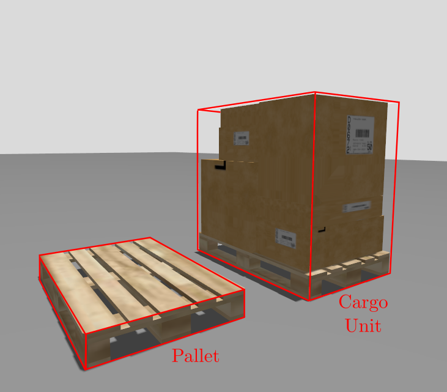
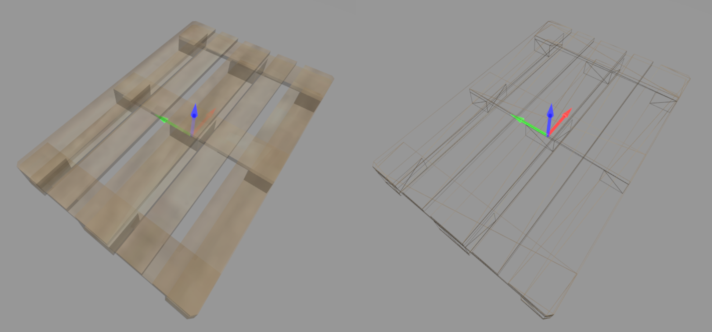

# cargo_planner_msgs

Package with ROS2 interfaces (messages and services) to interact with the `cargo_planner` node.

## Messages

### `CargoUnit.msg`

A cargo unit is the full rectangular load handled by the planner. It typically consists of a pallet and the goods carried on it.




| Field | Type | Description |
|-------|------|-------------|
| `id` | `string` | Unique cargo identifier |
| `lx` | `float64` | Size along cargo's x-axis [m] |
| `ly` | `float64` | Size along cargo's y-axis [m] |
| `lz` | `float64` | Size along cargo's z-axis [m] |

The x-axis in the cargo unit is always aligned with the length of the pallet (the longest horizontal dimension).
The y-axis is aligned with the width of the pallet.
The z-axis is vertical.



EUR-pallet standard footprint: `lx = 1.2 m, ly = 0.8 m`.

**Warning:** No goods must go beyond the pallet footprint. The planner assumes the cargo unit is a rectangular cuboid with dimensions `(lx m, ly m, lz m)` and does not account for any overhang. If the actual cargo has goods sticking out beyond the pallet footprint, the planner may produce placements that are not physically feasible.

### `CargoPlacement.msg`

Result of placing one cargo unit inside the truck's container:

| Field | Type | Description |
|-------|------|-------------|
| `id` | `string` | Matches `CargoUnit.id` |
| `pose` | `geometry_msgs/Pose` | 3D center pose in `container_frame` |
| `rotated` | `bool` | True if placed at 90° yaw |

Only `lx` and `ly` participate in the 2D placement algorithm.
`lz` is stored and forwarded to the 3D output pose (`z-center = lz / 2`).

When `rotated` is false, the cargo unit's x-axis is aligned with the container's x-axis and y-axis with the container's y-axis.
When `rotated` is true, the cargo unit's x-axis is aligned with the container's y-axis and y-axis with the container's x-axis. In other words, the cargo unit is rotated 90° around the z-axis compared to the non-rotated case.


## Services

### `ContainerOccupancyGridRegistration.srv`

Service type used by `container_occupancy_grid_registration` to store the
OccupancyGrid of the container interior.

```
Request:
  nav_msgs/OccupancyGrid grid_map
  float64                container_height
Response:
  bool   success
  string message
```

Container's length and width are inferred from grid metadata:
`container_length = info.width * info.resolution`,
`container_width  = info.height * info.resolution`.

### `CargoListRegistration.srv`

Service type used by `cargo_list_registration` to provide the list of cargo
units to load before calling `cargo_planning`.

```
Request:
  cargo_planner_msgs/CargoUnit[] cargo_units
Response:
  bool   success
  string message
```

### `PlanCargo.action`

Action type used by `cargo_planning` to run the placement algorithm and return
the cargo plan.

```
Request: (empty)
Response:
  cargo_planner_msgs/CargoPlacement[] placements
  string[]  no_placed
  float64   placed_area_m2
  float64   free_area_m2
  float64   total_area_m2
  float64   utilization_pct
```

## Typical call sequence

- Step 1: Call `container_occupancy_grid_registration` to provide the container grid map.
- Step 2: Call `cargo_list_registration` to provide the list of cargo units to load.
- Step 3: Call `cargo_planning` to run the planner and get the placement results.

Step 1 and Step 2 can be done in either order, but both must be done before Step 3. You can also call Step 1 or Step 2 multiple times to update the grid map or cargo list, and then call Step 3 again to re-plan with the new information.
